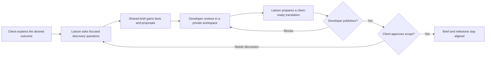
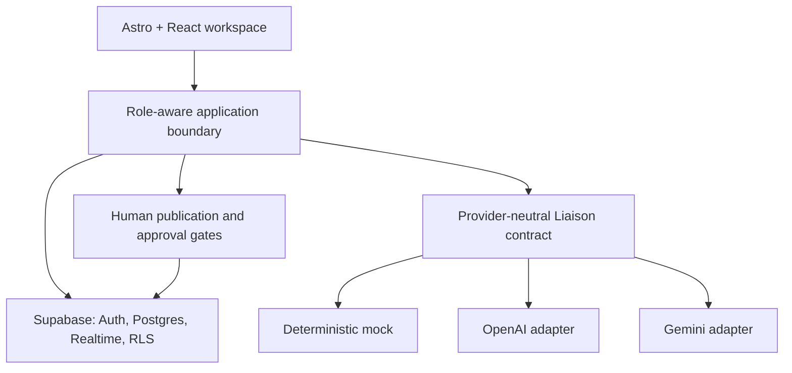

# Liaison

**A human-in-the-loop product discovery workspace that keeps client intent and engineering decisions aligned.**

Liaison began with a recurring product-delivery problem: clients describe outcomes in business language, engineers reason in technical shorthand, and the product brief slowly drifts away from both conversations. Chat preserves the messages; documents preserve the conclusions. Neither reliably preserves how one became the other.

I built Liaison as the translation layer between those two worlds. It interviews clients with targeted follow-up questions, turns confirmed answers into a living product brief, and gives developers a private workspace for feasibility notes and trade-offs. Liaison can prepare a client-friendly translation of engineering feedback, but a developer must review and publish it. Proposed scope and milestone changes likewise remain suggestions until the client accepts them.

## The design challenge

The interesting part was not generating text. It was deciding what the system must never decide on its own. Liaison treats trust as a product and architecture concern: private engineering notes stay private, translations start as drafts, scope changes require the correct human role, and every accepted change becomes part of a durable decision trail.

That principle is enforced beyond the interface. Production data is separated by role with Supabase Row Level Security; model output is validated against typed contracts; document updates use version checks and transactional writes; and AI providers sit behind a shared adapter so authorization rules do not change when the model changes.

## What I delivered

The four-day alpha includes a polished, zero-secret demo of the complete client-to-developer-to-client loop, plus a production path built with Astro, React, TypeScript, Supabase, Cloudflare Workers, OpenAI, and Gemini. The demo runs entirely in the browser with deterministic, versioned state, making the product story reliable to evaluate without an account, API key, or network dependency.

The result is not an autonomous product manager. It is a collaboration system that makes human judgment clearer: facts are distinguished from proposals, private reasoning is separated from published communication, and decisions remain legible after the conversation moves on.

**Project status:** Hackathon alpha  
**Focus:** Product strategy, interaction design, full-stack architecture, AI safety boundaries  
**Stack:** Astro, React, TypeScript, Tailwind CSS, Supabase, Cloudflare Workers, OpenAI Responses API, Gemini
