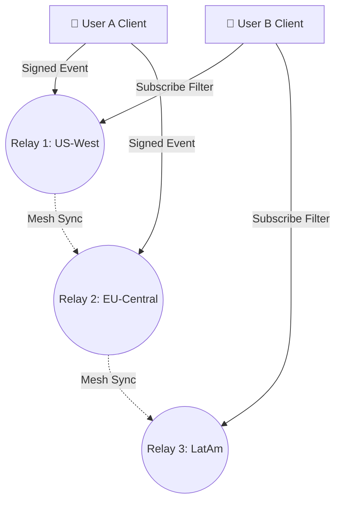

# 🔐 Lustre (Decentralized Identity & Protocol)

**Lustre** is an architectural research project exploring ideas around the **Nostr protocol**, decentralized identity, cryptographic verification, and censorship-resistant communication. It is not completed functionality and its design has not yet been proven in production.

## 🛡️ Why Decentralization? (First Principles)

In an era dominated by centralized walled gardens, preserving user ownership of identity and data is critical. Lustre implements first-principles engineering by:

- **Eliminating Vendor Lock-in:** Users own their public/private keypairs; identities cannot be suspended or altered by centralized platform authorities.
- **Relay Agnosticism:** Lightweight client architecture that connects to a distributed mesh of independent relays, ensuring uninterrupted messaging and data persistence.
- **High-Performance Rust Tooling:** Developing system-level scripts and verification pipelines using Rust to ensure maximum execution speed and memory safety.

## 🛠️ Technical Stack

- **Languages:** TypeScript, Rust
- **Protocols:** Nostr (Notes and Other Stuff Transmitted by Relays), Cryptographic Keypair Verification
- **Architecture:** Decentralized Relay Mesh, Event Signing Pipelines

## 🌐 Decentralized Relay Mesh Architecture

